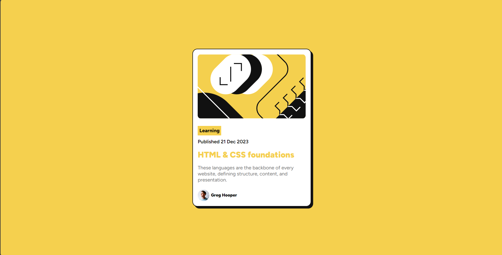

<div align="center">

  

  <h2>Frontend Mentor</h2>
  <p>
    <a href="https://www.frontendmentor.io/challenges/blog-preview-card-ckPaj01IcS" target="_blank"><strong>View Challenge</strong></a>
    <br />
    <br />
    <a href="https://git-test-no6y.vercel.app/" target="_blank">Live Demo</a>
  </p>
</div>

## Table of contents

- [Overview](#overview)
  - [The challenge](#the-challenge)
  - [Screenshot](#screenshot)
  - [Links](#links)
- [My process](#my-process)
  - [Built with](#built-with)
  - [What I learned](#what-i-learned)
  - [Continued development](#continued-development)
  - [Useful resources](#useful-resources)
- [Author](#author)

## Overview

### The challenge

Users should be able to:

- See hover and focus states for all interactive elements on the page

### Screenshot



### Links

- Solution URL: [Add solution URL here](https://github.com/trucanh21/git-test.git)
- Live Site URL: [Add live site URL here](https://git-test-no6y.vercel.app/)

## My process

### Built with

- Semantic HTML5 markup
- CSS custom properties
- Flexbox
- Mobile-first workflow

### What I learned

This project allowed me to deepen my understanding of building responsive layouts with Flexbox. Moreover, I enhanced my skills in managing colors and typography using CSS custom properties. Additionally, I learned how to create shadow effects and implement smooth color transitions.

```css
body {
  font-family: var(--primary-font);
  background-color: #f5d04e;
  display: flex;
  justify-content: center;
  align-items: center;
  height: 100vh;
  margin: 0px;
  box-shadow: 0 4px 10px rgba(0, 0, 0, 0.1);
}
```

```css
h1 {
  font-weight: 900;
  font-size: 25px;
  margin: 15px 0;
  transition: color 0.3s;
}
h1:hover {
  color: #f5d04e;
}
```

## Author

- Website - [Add your name here](https://github.com/trucanh21)
