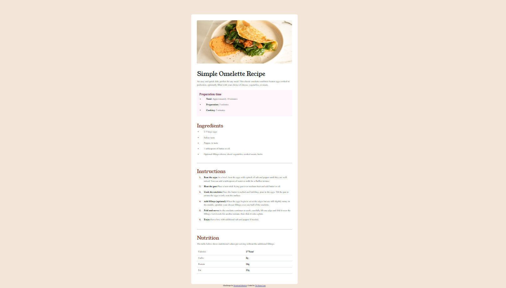

<div align="center">

  

  <h2>Frontend Mentor</h2>
  <p>
    <a href="https://www.frontendmentor.io/challenges/blog-preview-card-ckPaj01IcS" target="_blank"><strong>View Challenge</strong></a>
    <br />
    <br />
    <a href="https://git-test-gwhk.vercel.app/" target="_blank">Live Demo</a>
  </p>
</div>

## Table of contents

- [Overview](#overview)
  - [The challenge](#the-challenge)
  - [Screenshot](#screenshot)
  - [Links](#links)
- [My process](#my-process)
  - [Built with](#built-with)
  - [What I learned](#what-i-learned)
- [Author](#author)

## Overview

### Screenshot



### Links

- Solution URL: [Add solution URL here](https://github.com/trucanh21/git-test.git)
- Live Site URL: [Add live site URL here](https://git-test-gwhk.vercel.app/)

## My process

### Built with

- Semantic HTML5 markup
- CSS custom properties
- Flexbox
- CSS Grid

### What I learned

I learned how to use <table>, <ul>, <li>

```html
<table class="table mt-4">
  <tbody>
    <tr>
      <td>Calories</td>
      <td class="custom-td">277kcal</td>
    </tr>
    <tr>
      <td>Carbs</td>
      <td class="custom-td">0g</td>
    </tr>
    <tr>
      <td>Protein</td>
      <td class="custom-td">20g</td>
    </tr>
    <tr>
      <td>Fat</td>
      <td class="custom-td">22g</td>
    </tr>
  </tbody>
</table>
```

## Author

- Frontend Mentor - [@yourusername](https://www.frontendmentor.io/profile/trucanh21)
