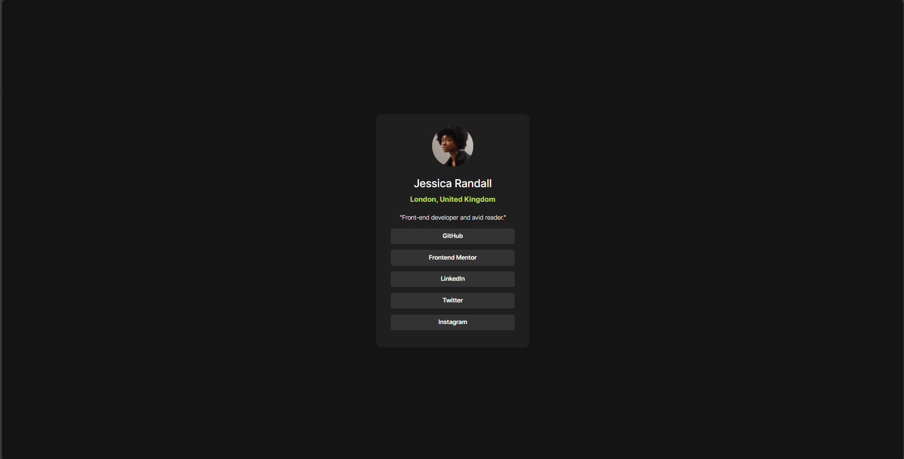

  

  <h2>Frontend Mentor - Social Links Profile</h2>
  

    <a href="https://www.frontendmentor.io/challenges/blog-preview-card-ckPaj01IcS" target="_blank"><strong>View Challenge</strong></a>
     
     
    <a href="https://git-test-ftrm.vercel.app/" target="_blank">Live Demo</a>
  

## Table of contents

- [Overview](#overview)
  - [The challenge](#the-challenge)
  - [Screenshot](#screenshot)
  - [Links](#links)
- [My process](#my-process)
  - [Built with](#built-with)
- [Author](#author)

## Overview

### The challenge

Users should be able to:

- See hover and focus states for all interactive elements on the page

### Screenshot

### Links

- Solution URL: [solution URL here](https://github.com/trucanh21/git-test.git)
- Live Site URL: [live site URL here](https://git-test-ftrm.vercel.app/)

## My process

### Built with

- Semantic HTML5 markup
- CSS custom properties
- Flexbox
- Bootstrap5

## Author

- Website - [Lan Ta](https://github.com/trucanh21)
